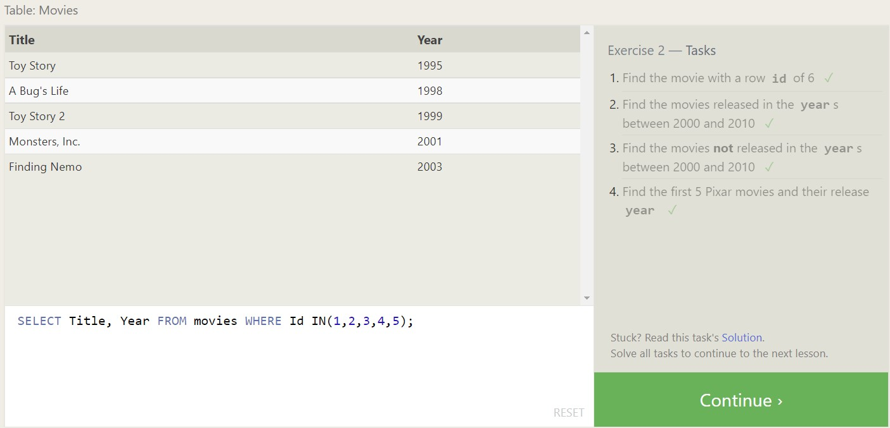

# Prep: Introduction to SQL

## SQL Lesson 1: SELECT queries 101

* This covered the most basic operation you use on SQL databases. You use a **SELECT** statement to query the properties (columns) you want to be shown for  of the instances (rows).

## SQL Lesson 2: Queries with constraints (Pt. 1)1

* This lesson goes into narrowing down your search by using a **WHERE** clause. You use different operators with the clause to return specific data that you're looking for for different properties.